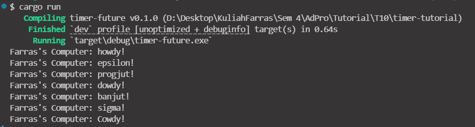
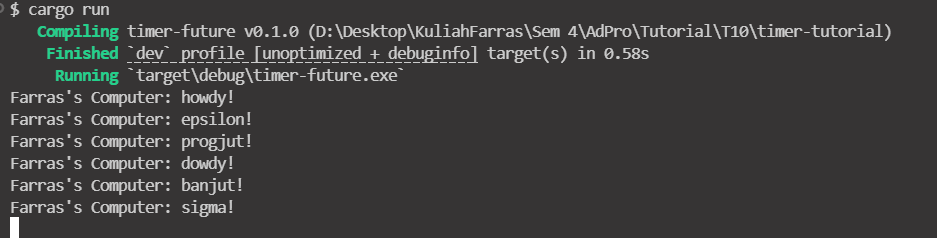

# Experiment 1.2

This is because spawn is lazy to begin with unless there is a explicit request. The executor is doing the explicit request so when it is running the spawn will run too. If you put the third print line after `executor.run()` it will show like what you expect.

# Experiment 1.3
## using `drop(spawner)`

## no `drop(spawner)`

When removing the statement `drop(spawner)` it did not exit the program which cause infinite run. Also the first 3 lines of output show that
in each spawn it is the first print line that get into the output then after that output the second line.

Spawner is used to create new futures. Executor is used to run the futures. 
