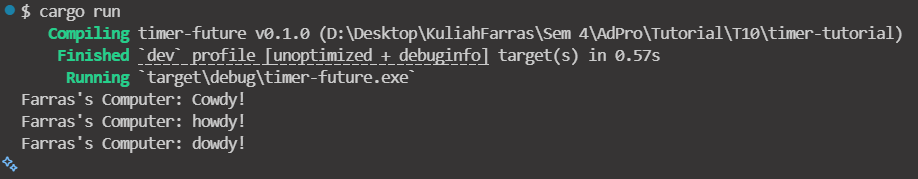

# Experiment 1.2

This is because spawn is lazy to begin with unless there is a explicit request. The executor is doing the explicit request so when it is running the spawn will run too. If you put the third print line after `executor().run` it will show like what you expect.